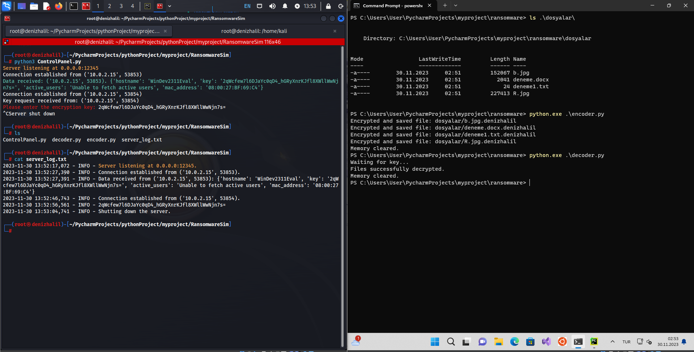

# RansomwareSim

</img>

## Overview
RansomwareSim is a simulated ransomware application developed for educational and training purposes. It is designed to demonstrate how ransomware encrypts files on a system and communicates with a command-and-control server. This tool is strictly for educational use and should not be used for malicious purposes.

## Features
- Encrypts specified file types within a target directory.
- Changes the desktop wallpaper (Windows only).
- Creates&Delete a README file on the desktop with a simulated ransom note.
- Simulates communication with a command-and-control server to send system data and receive a decryption key.
- Decrypts files after receiving the correct key.

## Usage
**`Important`:** This tool should only be used in controlled environments where all participants have given consent. Do not use this tool on any system without explicit permission. For more, read [SECURE](SECURITY.md)

## Requirements

- Python 3.x
- cryptography
- colorama

## Installation

1. Clone the repository:

   ```shell
   git clone https://github.com/HalilDeniz/RansomwareSim.git
   ```

2. Navigate to the project directory:

   ```shell
   cd RansomwareSim
   ```

3. Install the required dependencies:

   ```shell
   pip install -r requirements.txt
   ```

### Running the Control Server
1. Open `controlpanel.py`.
2. Start the server by running `controlpanel.py`.
3. The server will listen for connections from `RansomwareSim` and the `Decoder`.

### Running the Simulator
1. Navigate to the directory containing `RansomwareSim`.
2. Modify the `main` function in `encoder.py` to specify the target directory and other parameters.
3. Run `encoder.py` to start the encryption process.
4. Follow the instructions displayed on the console.


### Running the Decoder
1. Run `decoder.py` after the files have been encrypted.
2. Follow the prompts to input the decryption key.

## Disclaimer
RansomwareSim is developed for educational purposes only. The creators of RansomwareSim are not responsible for any misuse of this tool. This tool should not be used in any unauthorized or illegal manner. Always ensure ethical and legal use of this tool.

## Contributing
Contributions, suggestions, and feedback are welcome. Please create an issue or pull request for any contributions.
1. Fork the repository.
2. Create a new branch for your feature or bug fix.
3. Make your changes and commit them.
4. Push your changes to your forked repository.
5. Open a pull request in the main repository.


## Contact
For any inquiries or further information, you can reach me through the following channels:

- LinkedIn : [Halil Ibrahim Deniz](https://www.linkedin.com/in/halil-ibrahim-deniz/)
- TryHackMe: [Halilovic](https://tryhackme.com/p/halilovic)
- Instagram: [deniz.halil333](https://www.instagram.com/deniz.halil333/)
- YouTube  : [Halil Deniz](https://www.youtube.com/c/HalilDeniz)
- Email    : halildeniz313@gmail.com


## 💰 You can help me by Donating
  Thank you for considering supporting me! Your support enables me to dedicate more time and effort to creating useful tools like RansomwareSim and developing new projects. By contributing, you're not only helping me improve existing tools but also inspiring new ideas and innovations. Your support plays a vital role in the growth of this project and future endeavors. Together, let's continue building and learning. Thank you!"<br>
  [](https://buymeacoffee.com/halildeniz) 
  [](https://patreon.com/denizhalil) 

## License
RansomwareSim is released under the [MIT License](LICENSE). See LICENSE for more information.

  